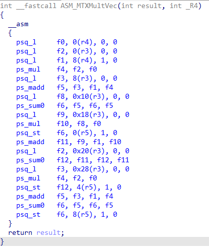
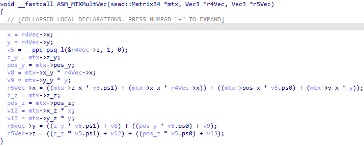
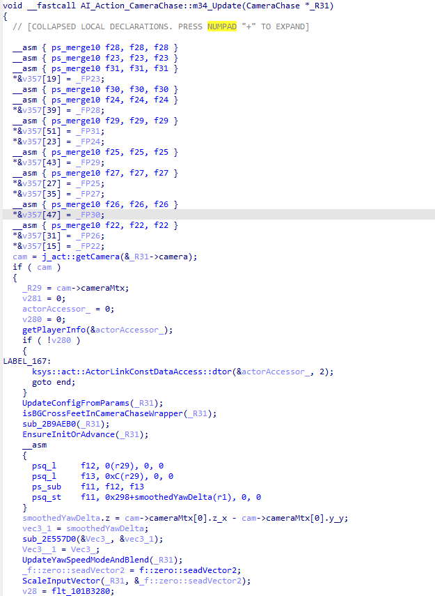
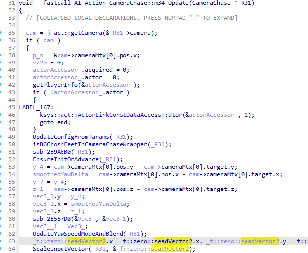

# PowerPC paired-single plugin for IDA's Pseudocode

This IDA plugin (currently targetting IDA 9.3) makes various improvements to the paired single floating point instructions support inside the decompiled pseudocode in IDA.

Although IDA supports instructions like e.g. `psq_l`, `psq_st`, these will show up as inline assembly statements `` inside the pseudocode, usually interleaved with normal floating point code.
Other times, the pseudocode would get confused and assume that the function setup happened much earlier and misplace the start of the body's function, which leads to be bad code generation.

Both of these issues make it quite hard to look through floating point heavy code in GameCube, Wii and Wii U games or executables.
That is what led me to creating this plugin, albeit with a healthy dose of AI coding. So use it or don't if the latter isn't your thing.

## Preview

| Before | After |
|---|---|
|  |  |
|  |  |

## Build

Set `IDASDK` to the IDA SDK root, either the repository root or its `src` directory, and `IDABIN` to your IDA install directory, then build with CMake and MSVC:

```cmd
cd ppc_ps_hexrays
cmake -B build -G "Visual Studio 17 2022" -A x64
cmake --build build --config Release
```

Use the matching Visual Studio generator for your installed MSVC version if it differs.

If `IDASDK` is not set, this project defaults to `../ida-sdk` from this repository.

If CMake is not on `PATH`, run the commands from a Visual Studio Developer PowerShell after installing CMake, or use the CMake executable bundled with Visual Studio.

The SDK CMake support deploys the plugin below `${IDABIN}/plugins/ppc_ps_hexrays/` when `IDABIN` points at an IDA installation. You can also copy the produced plugin directory to `%APPDATA%\Hex-Rays\IDA Pro\plugins\`.

## Current Coverage

Coverage is focused on the Wii U paired-single patterns that most affect decompilation quality.

- Exact displacement `psq_l` and `psq_st` forms are lowered early during microcode generation when `I=0`.
- `W=0` is emitted as two 32-bit float lane loads/stores, and `W=1` is emitted as a lane-0 float transfer plus the architectural lane-1 `1.0f` value.
- This early lowering happens before lvar allocation, which improves stack-variable recovery and lets Hex-Rays optimize away unused lanes like normal scalar float code.
- Quantized forms and non-displacement or indexed `psq_*` variants are not reinterpreted as exact memory traffic. They stay as typed helpers such as `__ppc_psq_l`, `__ppc_psq_st`, `__ppc_psq_lx`, or `__ppc_psq_stux` until there is enough reason to model their full GQR-dependent semantics.

- Wii U paired-single callee-save prologues are recognized and marked as prologue code.
- This includes `stfd fN, slot(r1)` + `ps_merge10 fN, fN, fN` + `stfs fN, slot+8(r1)` save sequences, as well as delayed `mflr rX` + `stw rX, sender_lr(r1)` patterns that belong to the same save block.
- Marking these as prologue keeps Hex-Rays from attaching save/setup instructions to the first real body block.

- The plugin lowers many common paired-single operations directly to lane-wise float microcode or per-lane scalar helpers: `ps_add`, `ps_sub`, `ps_mul`, `ps_div`, `ps_muls0`, `ps_muls1`, `ps_madd`, `ps_msub`, `ps_nmadd`, `ps_nmsub`, `ps_madds0`, `ps_madds1`, `ps_neg`, `ps_abs`, `ps_nabs`, `ps_mr`, `ps_merge00`, `ps_merge01`, `ps_merge10`, `ps_merge11`, `ps_sum0`, `ps_sum1`, `ps_res`, `ps_rsqrte`, and `ps_sel`.
- `ps_sum0` and `ps_sum1` are handled early, with an older scalar-use heuristic still available as a fallback when direct emission is not possible.
- Scalar PowerPC `fsel` is also handled and emitted as `__ppc_fsel(test, ge_zero, lt_zero)` with the expected PowerPC `test >= 0 ? ge_zero : lt_zero` behavior.

- Compare operations `ps_cmpu0`, `ps_cmpu1`, `ps_cmpo0`, and `ps_cmpo1` are emitted as typed helpers.
- Any paired-single operation that is recognized but not safely lowered still becomes a typed helper call instead of raw inline assembly, which preserves dataflow without pretending paired-single values are scalar doubles.

- The plugin installs a named `ppc_ps_t` typedef so helper signatures and propagated casts stay readable.
- A final ctree cleanup can rewrite simple whole-pair helper assignments back into adjacent float-lane expressions, including common `ps_madd`/`ps_msub` families and `psq_l(..., 1, 0)` lane materialization, so surviving helper-based output still decompiles more cleanly.
